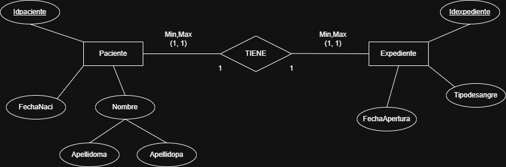
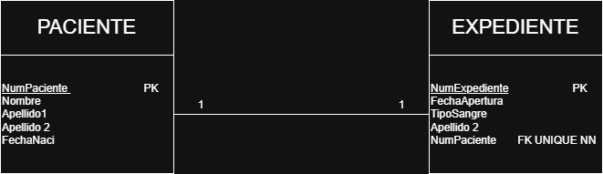
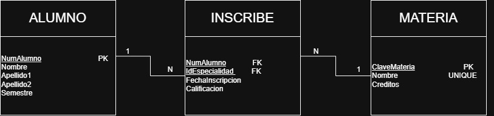
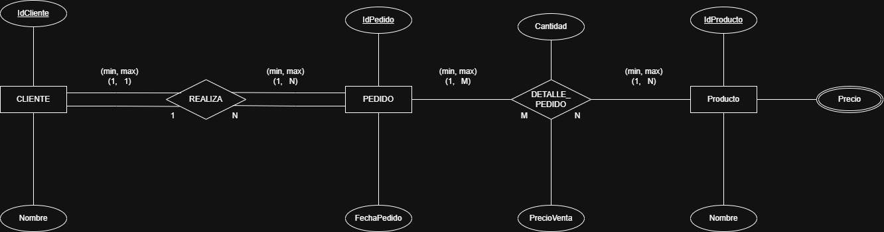
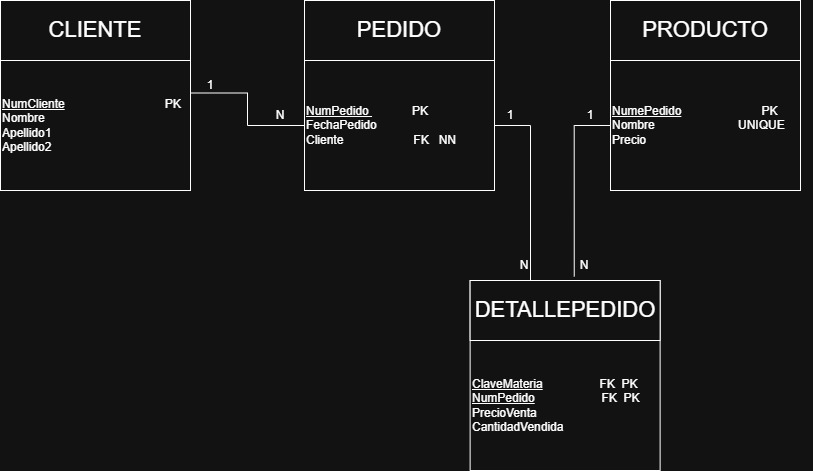
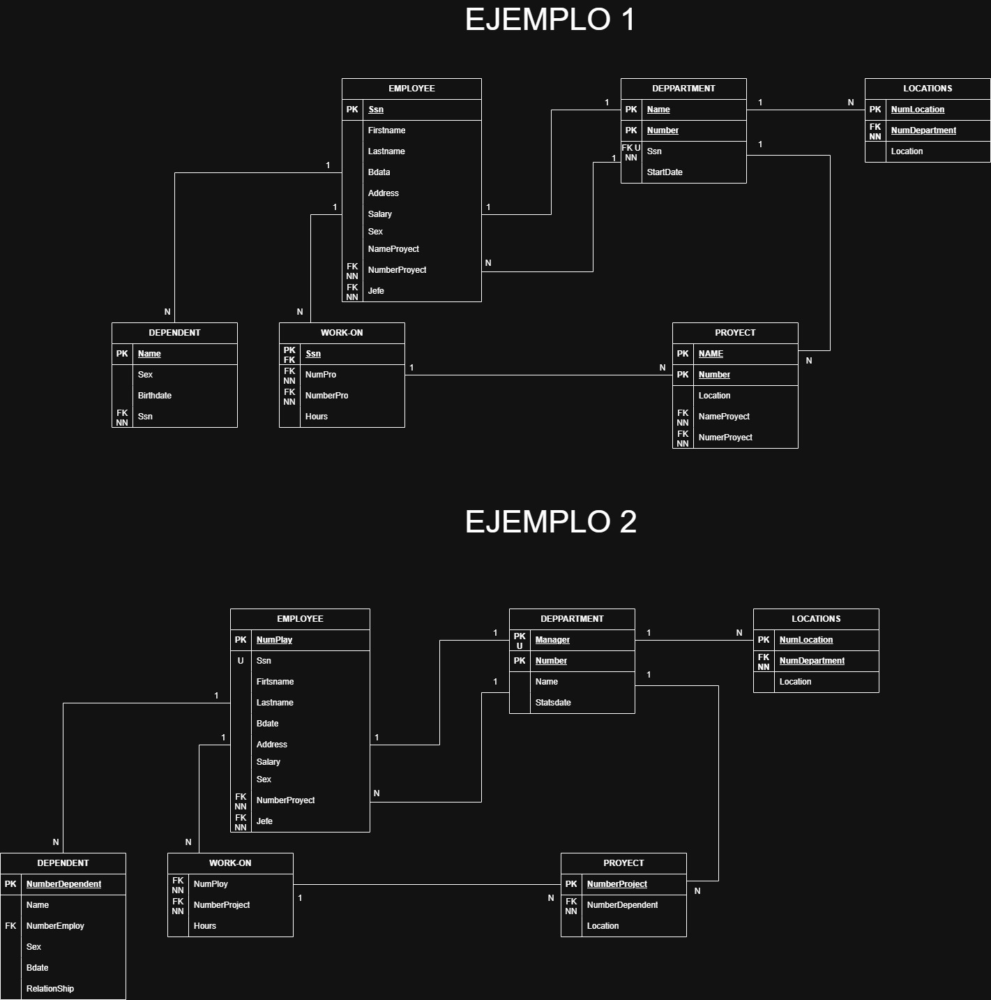
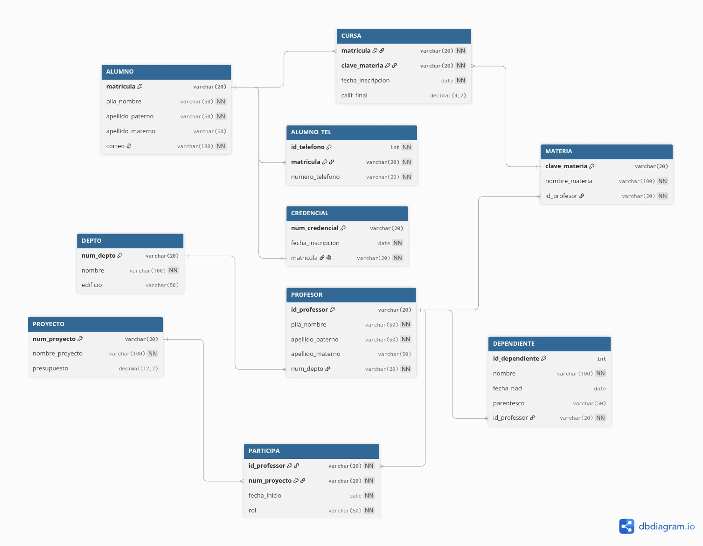

# Ejercicios de mapeo del Modelo E - R a Relacional

## Ejercicio 1

### modelo E-R

### modelo Relacional

## Ejercicio 2

### modelo E-R

### modelo Relacional

## Ejercicio 3

### modelo E-R

### modelo Relacional

## Ejercicio 4

### modelo E-R

### modelo Relacional

## Ejercicio 5

### modelo E-R

### modelo Relacional

## Ejercicio 6

### modelo E-R

### modelo Relacional

