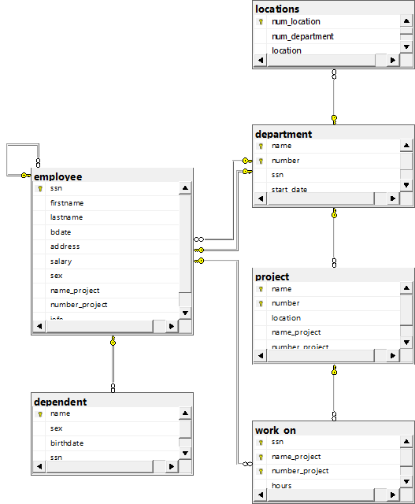

# Construcción de la base de datos Empresa — Ejemplo relacional 1

La base de datos contiene las tablas:

- `employee`
- `department`
- `locations`
- `project`
- `work_on`
- `dependent`

```sql
CREATE DATABASE empresa_ejemplo_1;
GO

USE empresa_ejemplo_1;
GO

/*===== CREAR TABLA EMPLOYEE =====*/
CREATE TABLE employee (
    ssn VARCHAR(20) NOT NULL
    CONSTRAINT pk_employee
    PRIMARY KEY,

    firstname VARCHAR(50) NOT NULL,
    lastname VARCHAR(50) NOT NULL,
    bdate DATE NOT NULL,
    address VARCHAR(150) NOT NULL,

    salary DECIMAL(10,2) NOT NULL
    CONSTRAINT ck_employee_salary
    CHECK (salary > 0),

    sex CHAR(1) NOT NULL,
    name_project VARCHAR(100) NOT NULL,
    number_project INT NOT NULL,
    jefe VARCHAR(20) NOT NULL
);
GO

/*===== CREAR TABLA DEPARTMENT =====*/
CREATE TABLE department (
    name VARCHAR(100) NOT NULL,
    number INT NOT NULL,
    ssn VARCHAR(20) NOT NULL,
    start_date DATE NOT NULL,

    CONSTRAINT pk_department
    PRIMARY KEY (name, number),

    CONSTRAINT uq_department_number
    UNIQUE (number),

    CONSTRAINT uq_department_ssn
    UNIQUE (ssn),

    CONSTRAINT fk_department_employee
    FOREIGN KEY (ssn)
    REFERENCES employee (ssn)
);
GO

/*===== AGREGAR FK EMPLOYEE - DEPARTMENT =====*/
ALTER TABLE employee
ADD CONSTRAINT fk_employee_department
FOREIGN KEY (number_project)
REFERENCES department (number);
GO

/*===== AGREGAR AUTORRELACIÓN DEL JEFE =====*/
ALTER TABLE employee
ADD CONSTRAINT fk_employee_jefe
FOREIGN KEY (jefe)
REFERENCES employee (ssn);
GO

/*===== CREAR TABLA LOCATIONS =====*/
CREATE TABLE locations (
    num_location INT NOT NULL IDENTITY(1,1)
    CONSTRAINT pk_locations
    PRIMARY KEY,

    num_department INT NOT NULL
    CONSTRAINT fk_locations_department
    REFERENCES department (number),

    location VARCHAR(100) NOT NULL
);
GO

/*===== CREAR TABLA PROJECT =====*/
CREATE TABLE project (
    name VARCHAR(100) NOT NULL,
    number INT NOT NULL,
    location VARCHAR(100) NOT NULL,
    name_project VARCHAR(100) NOT NULL,
    number_project INT NOT NULL,

    CONSTRAINT pk_project
    PRIMARY KEY (name, number),

    CONSTRAINT fk_project_department
    FOREIGN KEY (name_project, number_project)
    REFERENCES department (name, number)
);
GO

/*===== CREAR TABLA WORK_ON =====*/
CREATE TABLE work_on (
    ssn VARCHAR(20) NOT NULL,
    name_project VARCHAR(100) NOT NULL,
    number_project INT NOT NULL,
    hours DECIMAL(5,2) NOT NULL,

    CONSTRAINT pk_work_on
    PRIMARY KEY (
        ssn,
        name_project,
        number_project
    ),

    CONSTRAINT ck_work_on_hours
    CHECK (hours >= 0),

    CONSTRAINT fk_work_on_employee
    FOREIGN KEY (ssn)
    REFERENCES employee (ssn),

    CONSTRAINT fk_work_on_project
    FOREIGN KEY (name_project, number_project)
    REFERENCES project (name, number)
);
GO

/*===== CREAR TABLA DEPENDENT =====*/
CREATE TABLE dependent (
    name VARCHAR(100) NOT NULL
    CONSTRAINT pk_dependent
    PRIMARY KEY,

    sex CHAR(1) NOT NULL,
    birthdate DATE NOT NULL,

    ssn VARCHAR(20) NOT NULL
    CONSTRAINT fk_dependent_employee
    REFERENCES employee (ssn)
);
GO
```

