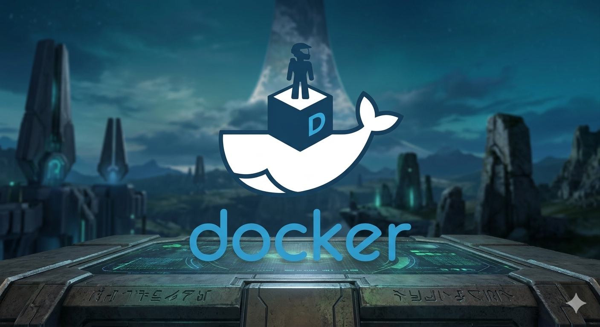

# Documentacion de contenedores Docker de Sistemas de Base de Datos

## Contenedor de tutorial de Docker
docker pull docker/getting-started

docker run -d -p

- -d detach (El proceso del contenedor se ejecuta en background)
- -p (port, publish) (Mapea el puerto)

## Contenedor del DBMS MariaDB
docker pull mariadb

| Comando | Descripcion |
| :--- | :--- |
| docker pull nombre_imagen | **Descarga una imageb de dockerhub** [Docker Hub](https://hub.docker.com/) |
| docker images | **Visualizar las imagenes que se encuentran en el docker** |